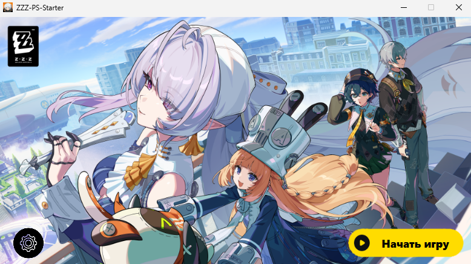
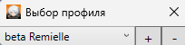
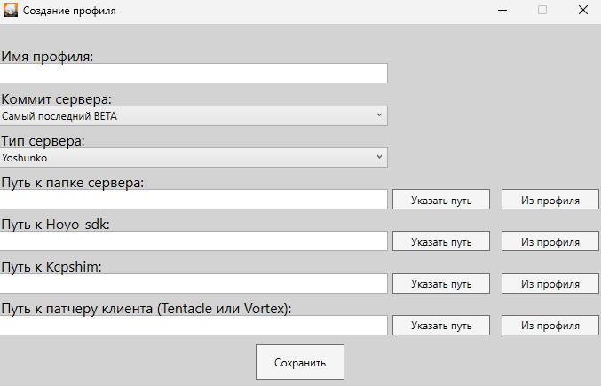

# ZZZ-PS-Launcher

**ZZZ-PS-Launcher** — это инструмент для автоматизации игровых сессий на кастомных (reversed rooms) серверах Zenless Zone Zero. Лаунчер берет на себя рутину по управлению версиями сервера, их сборке, а также запуску серверной и клиентской частей.

## ✨ Основные возможности
* **Автоматизация запуска:** Одновременный запуск сервера и клиента.
* **Управление процессами:** Автоматическое завершение всех связанных процессов при закрытии лаунчера.
* **Управление версиями:** Быстрое переключение коммитов сервера через `git checkout`.   
* **Проверка совместимости:** Лаунчер проводит проверку на совместимость версии сервера и клиента, для минимизации проблем.   
* **Синхронизация:** Автоматическое получение актуальной версии репозитория через `git pull` для смены коммита.

## ⚙️ Совместимость
> [!IMPORTANT]
> На данный момент лаунчер оптимизирован под версию **yoshunko**. 
> Поддержка ранних версий (Yidhari-ZS, Orphie-zs и др.) не гарантируется. Планируется поддержка поздних версий (Remielle и др.).

## 📋 Требования к системе
Перед использованием убедитесь, что у вас настроены:
* **WSL** (Windows Subsystem for Linux) с установленным дистрибутивом.
* **ZVM** (Zig Version Manager), установленный внутри вашего WSL-дистрибутива.
* **Рабочий сервер**, развернутый в WSL-дистрибутиве.
* **Игровой клиент** с установленным патчем для работы с reversed rooms серверами (патч должен находиться в корне папки клиента).

## 🚀 Установка
1. Загрузите лаунчер со страницы [Releases](https://github.com/Feaxmutch/ZZZ-PS-Launcher/releases).
2. Поместите скачанный `.exe` файл в любое удобное место на компьютере.
3. Запустите файл.
> [!TIP]
> Если Windows блокирует запуск приложения, нажмите на файл правой кнопкой мыши -> **Свойства** -> установите галочку **Разблокировать** (Unblock) внизу окна.

## 🏗️ Самостоятельная сборка
Для сборки лаунчера из исходного кода вам понадобятся:
1. Среда разработки **Visual Studio** (рекомендуется версия 2022 и выше).
2. Рабочая нагрузка **«Разработка настольных приложений .NET»** (включает поддержку WPF и C#).
3. Установленный SDK **.NET 10.0**.   

Откройте файл решения `ZZZ-PS-Launcher.slnx` двойным кликом мыши.   

---
### **Сборка с отдельным dll**   
В верхнем меню Visual Studio выберите **Сборка** > **Собрать решение** (Build > Build Solution).

Готовый `.exe` и `.dll` файлы будут находиться по пути:
`\bin\Release\net10.0-windows` или `\bin\Debug\net10.0-windows` (в зависимости от выбранной конфигурации).

---
### **Сборка без dll**   
Если вы хотите собрать лаунчер одним файлом:
1. Откройте меню **Сборка** > **Опубликовать выбранные элементы**   
2. нажмите кнопку **Опубликовать** в правом верхнем углу окна   

Нажмите на ссылку с права от параметра **Целевое расположение** чтобы открыть папку с лаунчером или перейдите по пути `\bin\Release\net10.0-windows\publish\win-x64`

## 📖 Использование

### Создание профиля
Для начала работы необходимо создать **профиль**, который хранит пути к ресурсам и параметры коммита.   

1. Нажмите на иконку **шестеренки** в левом нижнем углу.  
      

2. В открывшемся окне нажмите кнопку **"+"**, чтобы добавить новый профиль.  
      
   
3. Заполните данные:
   * **Имя профиля:** Имя вашего профиля.
   * **Коммит сервера:** Выберите нужную версию из выпадающего списка (содержит рекомендованные и последние актуальные коммиты).
   * **Пути:** Пути к клиенту и необходимым инструментам.  
> [!TIP]
> Если вы уже создали свой первый профиль, вы можете использовать пути из него, нажав кнопку **Из профиля**  

4. После настройки нажмите **"Начать игру"**.

## ⚠️ Disclaimer
Данное программное обеспечение предоставляется "как есть". Автор не несет ответственности за любые действия, предпринятые пользователем при использовании данного софта, включая, но не ограничиваясь, блокировки игровых аккаунтов или повреждение данных игры. Данный проект разрабатывается в свободное время. Прошу не ожидать оперативной поддержки.

## 🛠 Технологический стек
* **Language:** C#
* **UI Library:** WPF